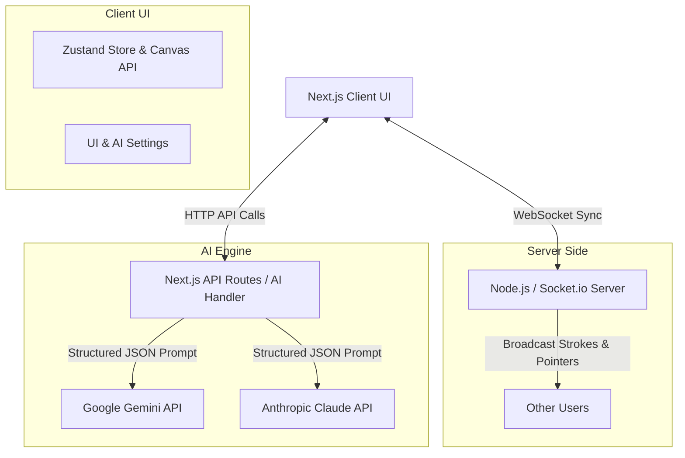

# 🎨 SynapseSketch: The AI-Powered Collaborative Canvas

SynapseSketch is an innovative, real-time collaborative drawing canvas where humans and AI can seamlessly draw, ideate, and create together. By integrating advanced generative AI (Google Gemini / Anthropic Claude), the platform goes beyond a simple drawing tool—it acts as an active participant that can colorize, autocomplete, clean up, and generate complex structural assets on the fly.

## 🌟 What Problem Does This Project Solve?

Traditional digital drawing tools are solitary or strictly peer-to-peer, requiring users to build every detail from scratch. SynapseSketch solves the "blank canvas paralysis" and speeds up workflow by:

1. **Assisted Creativity:** AI understands what you're sketching and can either autocomplete the drawing or add new geometric and stylized objects alongside it.
2. **Context-Aware Modification:** Need to colorize a sketch or remove messy scribbles? The embedded `ai-colorize` and `ai-eraser` tools intelligently modify targeted areas.
3. **Seamless Collaboration:** By connecting multiple users and an AI agent in the same room via WebSockets, it breaks the barrier between solitary ideation and interactive team brainstorming.

## ✨ Features

- 🖌️ **Real-time collaboration:** Draw with tools like Pencil, Eraser, and ASCII art brushes, synced perfectly across multiple users via WebSockets.
- 🤖 **AI Co-pilot:** The AI can generate structural primitives, perfect standard SVGs (like houses, bikes, cars), and even perform smart colorization.
- 💬 **Interactive Canvas:** Drop comments directly on the canvas space.
- ⚙️ **Configurable AI Models:** Choose between Gemini and Claude via a settings interface for your AI companion.
- 📱 **Responsive & Accessible:** Works across devices with touch support and an adaptive UI.

## 🏗️ Design Architecture & Flow

SynapseSketch is built as a complete Full-Stack Next.js 15 application utilizing a custom Node.js server to handle WebSockets for low-latency synchronization.

### High-Level Architecture Diagram

### Components

1. **Store `lib/store.ts` (Zustand):** Acts as the central source of truth for the clients, holding the state of strokes, tools, AI thoughts, and the WebSocket instance.
2. **Canvas `components/Canvas.tsx`:** An HTML5 `<canvas>` that translates user interaction and touch events into persistent data paths, while simultaneously reacting to Zustand state changes (like incoming drawing animations from the AI).
3. **AI Handler `lib/ai-handler.ts`:** Marshals canvas context (occupancy limits, colors, user prompts) and queries the AI model with strict json-schema enforcing structure parameters (lines, bezier curves, primitive circles, and SVGs). It renders responses locally and optionally streams modifications back through the store to peers.
4. **Custom WebSocket Server `server.ts`:** Listens for `stroke:update`, `stroke:finish`, `pointer:update` and dispatches multi-cast socket events across connected peers in the same room.

## 🚀 Getting Started

1. **Clone the repo**
2. **Setup Envs:** Copy `.env.example` to `.env.local` and add your `NEXT_PUBLIC_GEMINI_API_KEY` mapping.
3. **Install Dependencies:** `npm install`
4. **Run Dev Server:** `npm run dev` (Ensure `server.ts` starts listening)
5. **Open in Browser:** Navigate to `http://localhost:3000`
